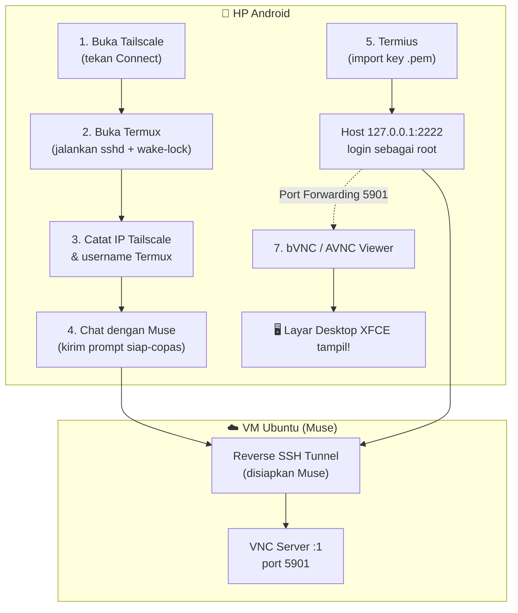

# M.U.S.E — J.O.K.O.W.I

### *Mobile Ubuntu Server Environment — Jaringan Operasi Koneksi OpenSSH Web Interface*

[](LICENSE)
[]()
[]()

> **Panduan lengkap mengakses VM Ubuntu dari HP Android** — dari nol sampai layar desktop tampil di HP kamu.
> Ditulis dengan bahasa sederhana. Setiap langkah dijelaskan **kenapa**-nya, dan semua perintah **siap salin-tempel**.

---

## ⚡ Mulai Cepat (versi 5 menit)

Buat yang maunya langsung jalan, ini ringkasannya. Detail tiap langkah ada di daftar isi bawah.

1. Install di HP: **Termux** (F-Droid), **Tailscale**, **Termius**, **bVNC/AVNC** (Play Store).
2. Di HP: konek Tailscale → buka Termux → jalankan `sshd` dan `termux-wake-lock` → catat IP Tailscale & username (`whoami`).
3. Kirim [prompt siap-copas](docs/03-prompt-muse.md) ke chat Muse (ganti `[bagian dalam kurung]` dengan datamu).
4. Muse akan menyiapkan tunnel + memberi file kunci `.pem`. Import ke Termius → buat host `127.0.0.1:2222` user `root`.
5. Di VM (via Termius): install XFCE + VNC → `vncpasswd` → jalankan `vncserver :1`.
6. Di Termius: tambah port forwarding `5901` → buka bVNC ke `127.0.0.1:5901`. Desktop tampil! 🎉

---

## ✅ Checklist Prasyarat

Centang satu per satu sebelum mulai. Kalau semua ✅, dijamin mulus.

- [ ] HP Android (minimal Android 7)
- [ ] Koneksi internet di HP & bisa buka Play Store / F-Droid
- [ ] 4 aplikasi terinstall: Termux, Tailscale, Termius, bVNC/AVNC → [detail](docs/01-persiapan-hp.md)
- [ ] Akun Tailscale (gratis, daftar pakai Google/GitHub/Microsoft)
- [ ] Akses chat Muse (tempat kamu kirim prompt)

---

## 📖 Kamus Istilah

Baru pertama kali dengar istilah-istilah ini? Wajar. Ini penjelasan sederhananya:

| Istilah | Artinya (bahasa sehari-hari) |
|---|---|
| **Tailscale** | Aplikasi VPN yang bikin HP dan VM seolah-olah satu jaringan lokal, walau beda kota/negara. Jadi mereka bisa saling "sapa". |
| **Termux** | Aplikasi terminal Linux di Android. Ibaratnya "CMD"-nya HP, tapi rasa Linux. |
| **SSH** | Cara aman untuk mengendalikan komputer lain lewat teks/perintah. Semua yang dikirim dienkripsi. |
| **Keypair / .pem** | Pasangan "kunci digital": kunci privat (kamu pegang, file `.pem`) + kunci publik (dipasang di VM). Seperti kunci & gembok — tanpa kunci yang cocok, tidak bisa masuk. Lebih aman dari password. |
| **Reverse tunnel** | Biasanya HP yang "menelepon" VM. Karena VM tidak bisa dihubungi langsung dari internet, dibalik: **VM yang menelepon HP**, lalu lewat sambungan itu HP bisa masuk ke VM. |
| **Termius** | Aplikasi SSH client yang enak dipakai di HP (ada di Play Store). |
| **VNC** | Teknologi untuk melihat & mengendalikan layar desktop komputer lain dari jauh. |
| **XFCE** | Tampilan desktop Linux yang ringan — cocok untuk VM supaya tidak lemot. |

---

## 🔄 Cara Kerja (Diagram Alur)



**Baca diagramnya gini:** HP konek Tailscale → Termux nyala → kamu chat Muse → Muse bikin "jembatan" (tunnel) dari VM ke HP → kamu masuk VM lewat Termius → VNC mengalirkan layar desktop ke HP.

---

## 🗺️ Daftar Isi Panduan

Ikuti berurutan dari nomor 1 sampai 7:

1. [📲 Persiapan aplikasi di HP Android](docs/01-persiapan-hp.md) — install 4 aplikasi + dari mana downloadnya
2. [🌐 Konfigurasi Tailscale & Termux](docs/02-jaringan-termux.md) — konek VPN, nyalakan sshd, catat IP & username
3. [🤖 Kirim prompt ke Muse](docs/03-prompt-muse.md) — template pesan siap-copas + penjelasan tiap permintaan
4. [🔑 Setup kunci & host di Termius](docs/04-termius-key-host.md) — import .pem, buat profil server, konek pertama kali
5. [🖥️ Install desktop XFCE & VNC di VM](docs/05-vnc-gui-vm.md) — dari install sampai VNC server jalan
6. [🔀 Port forwarding di Termius](docs/06-port-forwarding.md) — teruskan port 5901 ke HP
7. [🖼️ Buka layar desktop di HP](docs/07-buka-desktop.md) — konek via bVNC/AVNC, selesai!
8. [🛠️ Troubleshooting & FAQ](docs/08-troubleshooting.md) — kalau ada error, cek sini dulu

**Script siap-pakai** (biar makin gampang, tinggal jalankan):

- [`scripts/setup-termux.sh`](scripts/setup-termux.sh) — setup otomatis sisi Termux (HP)
- [`scripts/setup-vnc-vm.sh`](scripts/setup-vnc-vm.sh) — setup otomatis sisi VM (XFCE + VNC)

---

## 📁 Struktur Repo

```
M.U.S.E---J.O.K.O.W.I/
├── README.md                  ← kamu di sini (peta & mulai cepat)
├── LICENSE
├── docs/
│   ├── 01-persiapan-hp.md     ← install 4 aplikasi
│   ├── 02-jaringan-termux.md  ← Tailscale + Termux
│   ├── 03-prompt-muse.md      ← template chat ke Muse
│   ├── 04-termius-key-host.md ← import key & buat host
│   ├── 05-vnc-gui-vm.md       ← XFCE + VNC server
│   ├── 06-port-forwarding.md  ← forward port 5901
│   ├── 07-buka-desktop.md     ← buka di bVNC/AVNC
│   └── 08-troubleshooting.md  ← FAQ & solusi error
└── scripts/
    ├── setup-termux.sh        ← otomatisasi sisi HP
    └── setup-vnc-vm.sh        ← otomatisasi sisi VM
```

---

## 💬 Butuh Bantuan?

- Error atau bingung di tengah jalan? → [Troubleshooting & FAQ](docs/08-troubleshooting.md)
- Masih belum jelas? Salin pesan error / log terminal kamu, lalu tanya ke AI favoritmu (Gemini, Claude, ChatGPT, atau Muse sendiri) — sertakan link repo ini biar konteksnya nyambung.

---

## 📄 Lisensi

[MIT License](LICENSE) — bebas dipakai, diubah, dan dibagikan.

*Btw Hidup Jokowi* ✊
